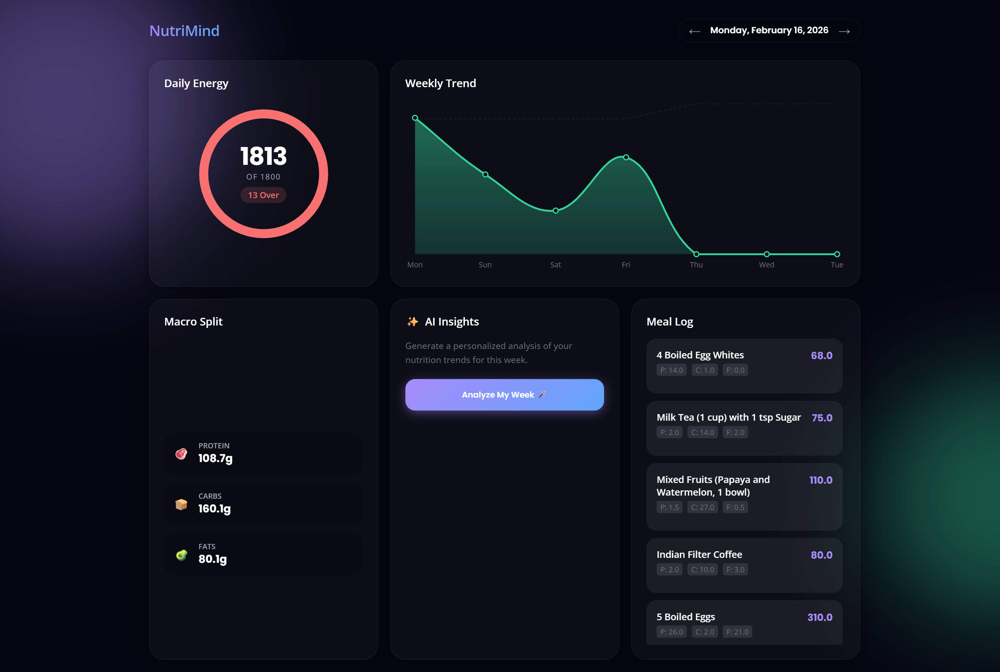

<p align="center">
  
  
  
  
  
  
</p>

# 🧠 NutriMind — AI-Powered Nutrition Tracker

**NutriMind** is a production-grade, AI-powered nutrition tracking system that lets users log meals through **Telegram** (text, photos, or voice notes), leverages a **LangChain Agent** powered by **Google Gemini 2.0 Flash** with a **USDA FoodData Central** vector database to deliver **verified nutritional data**, and syncs everything to **Notion** — with a beautiful real-time **web dashboard** for at-a-glance daily summaries.

> Built end-to-end: LangChain Agent → USDA RAG → Gemini AI → backend API → Telegram bot → web dashboard → containerized deployment → CI/CD pipeline.

---

## ✨ Key Features

| Feature | Description |
|---|---|
| 🔬 **3-Tier Nutrition Analysis** | USDA verified data → Gemini estimation → user clarification — layered accuracy system |
| 🧪 **Ingredient Decomposition** | Complex dishes (e.g., "paneer butter masala") are broken into individual ingredients, each looked up in USDA |
| 🤖 **LangChain Agent** | Autonomous agent with `usda_lookup` and `calculator` tools for precise macro computation |
| 📊 **USDA FoodData Central** | 7,756 verified foods embedded as vectors — sub-millisecond cosine similarity search via NumPy |
| 💬 **Telegram Bot Interface** | Full conversational bot with onboarding, meal logging, target setting, and meal editing |
| 📈 **Live Web Dashboard** | Mobile-optimized status page with calorie ring chart, macro breakdowns, and interactive meal editing |
| 📝 **Notion Sync** | Every meal is logged to a personal Notion database with daily pages, tables, and running totals |
| 🎯 **Customizable Targets** | Set daily calorie and macro targets via Telegram (`/set_targets`) |
| ✏️ **Meal Editing** | Edit or delete meals from both the web dashboard and Telegram (`/edit_meals`) |
| 🧠 **Preference Learning** | Say "Remember: my bowl is 300ml" and the bot learns your personal food preferences |
| 📸 **Multi-Modal Input** | Text descriptions, food photos, and voice notes — all analyzed by Gemini 2.0 Flash |
| 🐳 **Dockerized Deployment** | One-command deploy with Docker Compose, persistent data, SSL certificates |
| 🔄 **CI/CD Pipeline** | Push to `main` → GitHub Actions auto-deploys to DigitalOcean, including webhook re-registration |


---

## 📸 Screenshots

<p align="center">
  
  &nbsp;&nbsp;&nbsp;
  
</p>

<p align="center">
  <em>Left: Real-time web dashboard with calorie ring, macros & meal editing</em><br/>
  <em>Right: Telegram bot — AI food recognition from photos, instant logging</em>
</p>

---

## 🏗️ Architecture

```
┌──────────────┐     ┌──────────────────┐     ┌─────────────────┐
│   Telegram   │────▶│   FastAPI Server  │────▶│  LangChain Agent │
│  Bot Client  │◀────│   (Webhook)       │◀────│  (Gemini 2.0)    │
└──────────────┘     │                   │     └────────┬────────┘
                     │   ┌───────────┐   │              │
┌──────────────┐     │   │  SQLite   │   │     ┌────────▼────────┐
│ Web Dashboard│◀────│   │  (Users,  │   │     │  USDA Vector DB  │
│  (Browser)   │────▶│   │  Prefs)   │   │     │  (NumPy + JSON)  │
└──────────────┘     │   └───────────┘   │     └─────────────────┘
                     │                   │
                     │                   │     ┌─────────────────┐
                     │                   │────▶│   Notion API     │
                     │                   │◀────│  (Daily Logs)    │
                     └──────────────────┘     └─────────────────┘
                            │
                     ┌──────┴──────┐
                     │   Docker    │
                     │  Container  │
                     │(DigitalOcean)│
                     └─────────────┘
```

### Data Flow

1. User sends a meal (text/photo/voice) via Telegram
2. FastAPI webhook receives the update
3. **Text inputs** → LangChain Agent decomposes the dish into ingredients:
   - Each ingredient is looked up in the **USDA vector database** (7,756 foods)
   - USDA matches → **Verified** data, adjusted to portion weight via calculator tool
   - No match → Gemini estimates → **Estimated** data
4. **Image/Audio inputs** → Direct Gemini 2.0 Flash analysis
5. Results are stored in Notion (daily page + table rows) and SQLite (user profiles)
6. Web dashboard reads from Notion and displays real-time stats

---

## 🔬 Intelligent Nutrition Analysis

NutriMind uses a **3-tier accuracy system** powered by a LangChain Agent:

```
User Input: "paneer butter masala with 2 rotis"
                    │
                    ▼
        ┌─── DECOMPOSE ───┐
        │ paneer (100g)    │
        │ butter (15g)     │
        │ tomato (100g)    │
        │ cream (30g)      │
        │ onion (50g)      │
        │ oil (10g)        │
        │ spices (5g)      │
        │ wheat flour(120g)│
        └────────┬─────────┘
                 │
    ┌────────────▼───────────┐
    │  USDA Vector Search    │
    │  (cosine similarity)   │
    └────────────┬───────────┘
                 │
    ┌────────────▼───────────┐
    │ Found?  ──── Yes ──── ✅ Verified (per 100g)
    │         └── No ─────── 🟡 Gemini Estimate
    └────────────┬───────────┘
                 │
    ┌────────────▼───────────┐
    │  Calculator Tool       │
    │  Scale to actual       │
    │  portion weight        │
    └────────────┬───────────┘
                 │
                 ▼
         Final JSON Output
         (7/8 items Verified)
```

### Agent Tools

| Tool | Purpose |
|---|---|
| `usda_lookup` | Searches 7,756 USDA foods via cosine similarity over `gemini-embedding-001` embeddings |
| `calculator` | Mathematical expressions for precise macro scaling (e.g., `717 * 0.15` for 15g of butter) |

### Beverage Intelligence

The agent properly decomposes beverages (not treating milk tea as pure milk):
- **Milk tea** → 80ml milk + 170ml water + tea leaves (~40 kcal, ~2.6g protein)
- **Lassi** → 200g yogurt + water + sugar
- **Coffee** → 50ml milk + 200ml water

---

## 🛠️ Tech Stack

| Layer | Technology | Purpose |
|---|---|---|
| **AI Agent** | LangChain + Gemini 2.0 Flash | Autonomous reasoning agent with tool calling |
| **Vector Search** | NumPy + Google Embeddings | 7,756 USDA foods, cosine similarity in <1ms |
| **AI / ML** | Google Gemini 2.0 Flash | Food recognition, nutrition estimation, voice transcription |
| **Backend** | Python 3.11+, FastAPI, Uvicorn | Async REST API, webhook handling, business logic |
| **Database** | SQLite (aiosqlite) | User profiles, preferences, onboarding state |
| **Data Store** | Notion API | Daily nutrition logs, meal tables, running totals |
| **Bot Platform** | Telegram Bot API | User interface — text, photo, and voice input |
| **Frontend** | HTML5, CSS3, JavaScript, Jinja2 | Real-time dashboard with interactive meal editing |
| **Containerization** | Docker, Docker Compose | Reproducible builds, volume persistence, SSL mounting |
| **CI/CD** | GitHub Actions | Auto-deploy on push to `main` via SSH |
| **Infrastructure** | DigitalOcean Droplet | Cloud hosting with self-signed SSL certificates |

---

## 📂 Project Structure

```
Project_Nutrition/
├── app/
│   ├── main.py              # FastAPI app, routes, status dashboard
│   ├── agent.py             # LangChain Agent (Gemini + USDA tools)
│   ├── usda_rag.py          # NumPy vector search over USDA embeddings
│   ├── telegram_handler.py  # Command routing, meal logging, edit flows
│   ├── telegram_client.py   # Thin async Telegram Bot API client
│   ├── gemini_service.py    # Gemini 2.0 Flash integration (text/image/audio)
│   ├── nutrition_engine.py  # Food analysis pipeline & clarification handling
│   ├── notion_service.py    # Notion database CRUD: pages, tables, totals
│   ├── database.py          # SQLite: user profiles, preferences, state
│   ├── onboarding.py        # Multi-step conversational onboarding flow
│   ├── preferences.py       # User preference learning ("Remember: ...")
│   ├── config.py            # Environment-based configuration
│   └── templates/
│       └── status.html      # Dashboard: calorie ring, macros, meal editing
├── scripts/
│   └── ingest_usda.py       # One-time USDA data download, parse & embed
├── data/                    # Generated: USDA vector store (gitignored)
│   └── usda_chroma/
│       ├── embeddings.npz   # 7,756 food embeddings (compressed NumPy)
│       └── metadata.json    # Food names + nutrition per 100g
├── .github/
│   └── workflows/
│       └── deploy.yml       # CI/CD: auto-deploy to DigitalOcean on push
├── Dockerfile               # Python 3.11-slim with curl for webhook setup
├── docker-compose.yml       # Service definition with volumes & SSL
├── entrypoint.sh            # Container startup: USDA check + server + webhook
├── requirements.txt         # Python dependencies
├── .env.example             # Environment variable template
└── .gitattributes           # Enforce LF line endings for shell scripts
```

---

## 🚀 Getting Started

### Prerequisites

- Python 3.11+
- A [Telegram Bot Token](https://core.telegram.org/bots#creating-a-new-bot) (from BotFather)
- A [Google AI API Key](https://aistudio.google.com/apikey) (for Gemini 2.0 Flash)
- A [Notion Integration](https://www.notion.so/my-integrations) API key + a parent page ID

### 1. Clone & Configure

```bash
git clone https://github.com/ayushupadhyayft262013-rgb/NutriMind.git
cd NutriMind

cp .env.example .env
# Edit .env with your API keys and configuration
```

### 2. Run Locally

```bash
pip install -r requirements.txt

# One-time: Generate USDA vector store (~5 minutes)
python scripts/ingest_usda.py

# Start the server
python -m uvicorn app.main:app --host 0.0.0.0 --port 8000 --reload
```

For local Telegram testing, use [ngrok](https://ngrok.com/) to expose your local server:
```bash
ngrok http 8000
# Then set the webhook: https://api.telegram.org/bot<TOKEN>/setWebhook?url=<NGROK_URL>/webhook/telegram
```

### 3. Deploy with Docker

```bash
# Generate self-signed SSL certificates (required for Telegram webhooks on IP addresses)
mkdir certs
openssl req -newkey rsa:2048 -sha256 -nodes \
  -keyout certs/key.pem -x509 -days 365 -out certs/cert.pem \
  -subj "/CN=YOUR_SERVER_IP"

# Build and run (USDA ingestion runs automatically on first deploy)
docker compose up --build -d
```

### 4. CI/CD (GitHub Actions)

Every push to `main` automatically:
1. SSH into the DigitalOcean droplet
2. Pulls the latest code
3. Rebuilds the Docker image
4. Restarts the container (USDA data persists via Docker named volume)
5. Re-registers the Telegram webhook with the SSL certificate

Required GitHub Secrets: `DROPLET_IP`, `DROPLET_USER`, `DROPLET_SSH_KEY`, `TELEGRAM_BOT_TOKEN`

---

## 💬 Bot Commands

| Command | Description |
|---|---|
| `/start` | Begin onboarding (name, weight, height, age, activity, goal) |
| `/set_targets` | View or change daily nutrition targets |
| `/edit_meals` | List, edit, or delete today's logged meals |
| `/today` | View today's nutrition summary |
| `/profile` | View your profile and targets |
| `/preferences` | View learned food preferences |
| `/start_tracking` / `/stop_tracking` | Toggle meal logging on/off |
| `/setup_notion` | Initialize your personal Notion database |
| `/help` | Show all available commands |

**Logging meals is as simple as:**
- 📝 Text: *"Had chicken biryani and raita for lunch"*
- 📸 Photo: Send a picture of your plate
- 🎤 Voice: Record a voice note describing your meal

---

## 📊 Web Dashboard

The `/status` endpoint serves a mobile-optimized dashboard featuring:

- **Calorie Ring** — animated SVG progress ring with gradient colors
- **Macro Cards** — protein, carbs, and fats with progress bars
- **Meal List** — every logged meal with inline **edit** and **delete** buttons
- **Verified/Estimated Tags** — meals show ✓ (USDA verified) or ≈ (Gemini estimated)
- **Real-time Updates** — editing a meal instantly recalculates all totals via REST API
- **Dark Theme** — premium dark glassmorphism design

---

## 🔧 Environment Variables

```env
# Telegram
TELEGRAM_BOT_TOKEN=your_bot_token
WEBHOOK_BASE_URL=https://your-server-ip:8443

# Google AI
GOOGLE_API_KEY=your_gemini_api_key

# Notion
NOTION_API_KEY=your_notion_integration_token
NOTION_PARENT_PAGE_ID=your_notion_page_id

# Defaults
DEFAULT_TARGET_KCAL=2000
DEFAULT_TARGET_PROTEIN=150

# USDA RAG (optional overrides)
USDA_CHROMA_PATH=data/usda_chroma       # Vector store location
USDA_MATCH_THRESHOLD=0.73               # Cosine similarity threshold

# SSL (for production)
SSL_CERTFILE=/app/certs/cert.pem
SSL_KEYFILE=/app/certs/key.pem
```

---

## 🔑 Skills Demonstrated

- **AI Agent Engineering** — LangChain agent with autonomous tool calling, multi-step reasoning, and fallback strategies
- **RAG (Retrieval-Augmented Generation)** — Vector embeddings over USDA data, cosine similarity search, source verification
- **Prompt Engineering** — Multi-modal food analysis with Gemini 2.0 Flash (text, image, audio), beverage decomposition rules
- **Full-Stack Development** — Python backend + interactive JavaScript frontend with real-time API-driven updates
- **API Design** — RESTful endpoints with FastAPI, async/await patterns, proper error handling
- **Bot Development** — Stateful conversational flows, multi-step onboarding, command handling
- **Third-Party Integration** — Telegram Bot API, Notion API, Google Generative AI SDK, USDA FoodData Central
- **DevOps & Deployment** — Docker containerization, Docker Compose, GitHub Actions CI/CD, SSL certificates
- **Cloud Infrastructure** — DigitalOcean droplet provisioning, SSH-based deployments, self-signed HTTPS
- **Database Design** — SQLite for user state, Notion for structured nutrition data, NumPy vector store for USDA search
- **UI/UX Design** — Mobile-first dark theme dashboard with animations, glassmorphism, and micro-interactions

---

## 📄 License

This project is for educational and portfolio purposes.

---

<p align="center">
  Built with ❤️ using AI-first development practices
</p>
